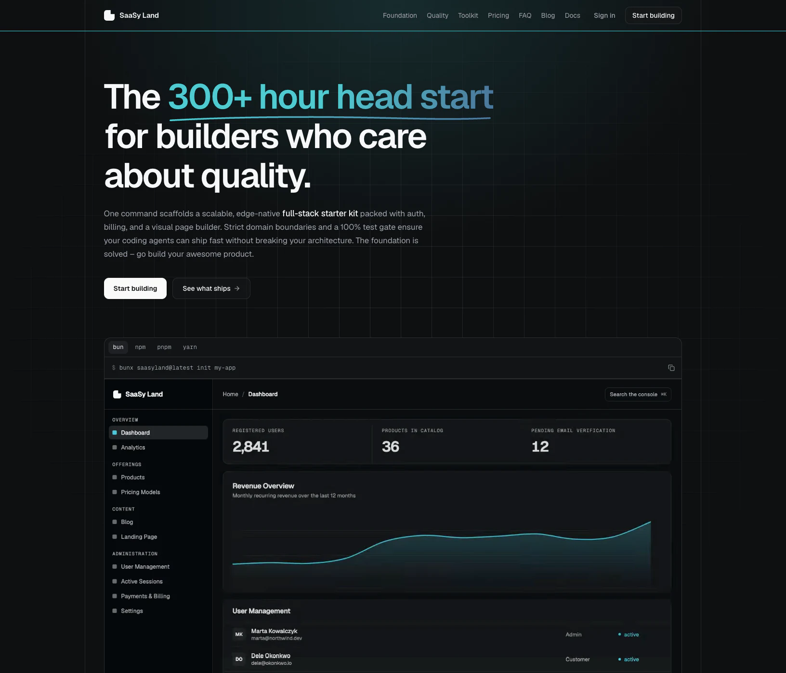

# SaaSy Land

Source code for the SaaSy Land website, customer workspace, and admin console. The application combines a multilingual marketing site, documentation and blog, authentication, newsletter subscriptions, and Polar checkout and licence management in one TanStack Start application deployed to Cloudflare Workers.

This repository contains the website application. The SaaSy Land CLI and private generator templates are maintained separately and are not included here. See [licensing](#licensing) for the distinction between the website source and the commercial product.

[](.github/assets/landing-page.jpg)

The landing page in September 2026. [View the full page](.github/assets/landing-page.jpg).

## Contents

- [Features and implementation status](#features-and-implementation-status)
- [Technology](#technology)
- [Getting started](#getting-started)
- [Configuration and integrations](#configuration-and-integrations)
- [Project structure and conventions](#project-structure-and-conventions)
- [Commands and verification](#commands-and-verification)
- [Database and deployment](#database-and-deployment)
- [Localization and content](#localization-and-content)
- [Performance](#performance)
- [Landing page videos](#landing-page-videos)
- [Contributing](#contributing)
- [Licensing](#licensing)

## Features and implementation status

The application includes both connected workflows and UI demonstrations. A rendered admin screen does not necessarily have a persistent backend workflow.

| Area                        | Current implementation                                                                                                                                                                                                                      |
| --------------------------- | ------------------------------------------------------------------------------------------------------------------------------------------------------------------------------------------------------------------------------------------- |
| Public website              | Landing page, pricing presentation, localized legal pages, responsive layouts, theme support, and reduced-motion presentations. Public pages are prerendered during builds.                                                                 |
| Documentation and blog      | Localized MDX content, navigation, and documentation search through Fumadocs. Published content is maintained in Git.                                                                                                                       |
| Authentication              | Email/password registration with required email verification, GitHub and Google sign-in, password recovery, TOTP with backup codes, and session management.                                                                                 |
| Customer workspace          | Protected `/app` area and `/app/license` for the customer's licence key, machine activations, and activation deactivation.                                                                                                                  |
| Billing                     | Authenticated Polar checkout for the Core, Complete, and Agency tiers, with webhook handling for purchases, refunds, and licence-key benefits. Requires configured provider products and credentials.                                       |
| Newsletter                  | Subscription, confirmation, unsubscribe, and subscription-preference server functions with localized email delivery.                                                                                                                        |
| Admin users and security    | Database-backed user listing, password reset, ban/unban, and deletion. The settings security tab connects password changes, TOTP, and session revocation.                                                                                   |
| Products and categories     | D1 schemas, permission-checked CRUD use cases, and database-backed lists. Product creation/publishing controls are not fully connected.                                                                                                     |
| Demo and unfinished screens | Analytics, payment administration, blog administration, invitations, and role-management views include demo data. General settings, course creation, and the landing-page editor include unconnected controls. `/premium` is a placeholder. |

The admin blog editor does not publish the MDX blog, and the course and page-editor screens do not yet constitute complete authoring systems. User creation/edit/profile controls also remain incomplete. The built-in application roles are `admin` and `customer`; new accounts receive `customer`.

## Technology

| Responsibility                   | Implementation                                                                                         |
| -------------------------------- | ------------------------------------------------------------------------------------------------------ |
| Application and routing          | React 19, TypeScript, TanStack Start and Router                                                        |
| Toolchain                        | Bun, Vite+, formatting, linting, and type checking configured in `vite.config.ts`                      |
| Hosting and storage              | Cloudflare Workers, D1 (SQLite), KV, and static assets                                                 |
| Database access                  | Drizzle ORM and checked-in SQLite migrations                                                           |
| Authentication and authorization | Better Auth with module-level permissions and server-function middleware                               |
| Data and forms                   | TanStack Query, Form, and Table; Zod validation                                                        |
| UI                               | Tailwind CSS 4, shadcn-styled components with React Aria and Base UI, Motion, and locally served fonts |
| Localization and content         | `use-intl`, ICU messages, Fumadocs, and MDX                                                            |
| External services                | Resend for email; Polar for checkout, billing, and licence keys                                        |
| Verification                     | Vite+/Vitest, Testing Library, jsdom, and Playwright                                                   |

[`package.json`](package.json) and [`bun.lock`](bun.lock) define the application toolchain. The separate [Remotion project](remotion/README.md) uses its own npm lockfile.

## Getting started

### Prerequisites

- **Bun 1.4.0**, matching `packageManager` and CI.
- **Node.js 24.11 or newer within the 24.x release line**, matching the locked Vite+ engine requirement and the Node 24 CI configuration. Node is also needed by the SQLite test harness.
- A Cloudflare account and provider credentials for development against real services. The isolated preview and automated tests below do not require those accounts.

From the repository root:

```sh
bun install --frozen-lockfile
```

The install lifecycle configures Vite+ and generates the class-name tables and Fumadocs content. If you install with `--ignore-scripts`, run `bun run typegen` afterward to generate Worker declarations, class-name tables, and content types.

### Run an isolated local preview

Use the committed test environment to explore the application with local D1/KV storage, test accounts, and intercepted provider requests:

```sh
bun run db:migrate:test
bun run db:seed:test
bun run build:test
bun run start:test
```

Open <http://127.0.0.1:3000>. Sign in with either account below; both use the password `WorkerTestPassword123!` from [`e2e/data/accounts.ts`](e2e/data/accounts.ts).

| Role     | Email                             | Workspace |
| -------- | --------------------------------- | --------- |
| Admin    | `admin@saasyland.example.test`    | `/admin`  |
| Customer | `customer@saasyland.example.test` | `/app`    |

This serves a built test application; rebuild it to see source changes. It uses dummy values from [`.env.test`](.env.test), the `test` environment in [`wrangler.jsonc`](wrangler.jsonc), and isolated state under `.wrangler/test`. Provider interception is intended for local verification, not for validating real OAuth, email delivery, or payments. Keep this test configuration local.

### Develop with Cloudflare and provider integrations

The development server supports hot reload at <http://localhost:3000>. Its `DB` and `CACHE` bindings connect to **remote preview resources**. Consequently, development database writes and `db:migrate:development` affect that preview database.

1. Sign in to Cloudflare and copy the environment template:

   ```sh
   bunx wrangler login
   cp .env.example .env.development
   openssl rand -base64 48
   ```

2. Set the generated value as `AUTH_SECRET` in `.env.development`, then fill in the [integration settings](#configuration-and-integrations). Use `POLAR_SERVER=sandbox` for development.
3. If using your own Cloudflare account, [provision D1 and KV](#provision-cloudflare-resources) and replace the development and preview binding IDs before continuing. The checked-in IDs belong to the existing deployment.
4. Apply the migrations and start the server:

   ```sh
   bun run db:migrate:development
   bun run dev
   ```

Email/password signup requires a functioning Resend configuration because accounts must verify their email before signing in. GitHub/Google sign-in and checkout require their respective provider configuration. Use the isolated preview when you only need to inspect the UI without those services.

There is no development admin seed. To bootstrap an installation, create and verify your account, then use D1 or Drizzle Studio to set that account's `user.role` to `admin` in the intended database. The test seed only populates the isolated test database.

## Configuration and integrations

### Environment files

Use `.env.development`, `.env.preview`, and `.env.production` for their corresponding environments. These files are ignored by Git; [`.env.example`](.env.example) lists the configuration keys. `.env.test` contains committed dummy values for isolated tests.

Server integrations read secrets through `env` from `cloudflare:workers`. Do not give private credentials a `VITE_` prefix, which makes values available to browser code. Deployment scripts upload the matching environment file with Wrangler's `--secrets-file` option.

| Variables                                                                       | Purpose                                                                                                                  |
| ------------------------------------------------------------------------------- | ------------------------------------------------------------------------------------------------------------------------ |
| `AUTH_SECRET`                                                                   | Long random secret used by Better Auth. Generate a separate value for each deployment environment.                       |
| `AUTH_GITHUB_CLIENT_ID`, `AUTH_GITHUB_CLIENT_SECRET`                            | GitHub OAuth application credentials.                                                                                    |
| `AUTH_GOOGLE_CLIENT_ID`, `AUTH_GOOGLE_CLIENT_SECRET`                            | Google OAuth application credentials.                                                                                    |
| `RESEND_API_KEY`, `RESEND_EMAIL_FROM`                                           | Email API credentials and the sender accepted by your Resend account.                                                    |
| `POLAR_SERVER`                                                                  | Polar environment: `sandbox` for development or `production` for live billing.                                           |
| `POLAR_ACCESS_TOKEN`, `POLAR_ORGANIZATION_ID`                                   | Polar API access and the organization used for discounts and licence operations.                                         |
| `POLAR_WEBHOOK_SECRET`                                                          | Secret used to verify Polar webhook deliveries.                                                                          |
| `POLAR_PRODUCT_ID_CORE`, `POLAR_PRODUCT_ID_COMPLETE`, `POLAR_PRODUCT_ID_AGENCY` | Product IDs mapped to the three checkout tiers. Use IDs from the selected Polar environment.                             |
| `CLOUDFLARE_ACCOUNT_ID`, `CLOUDFLARE_DATABASE_ID`, `CLOUDFLARE_ACCESS_TOKEN`    | Credentials for Drizzle Studio and introspection over the D1 HTTP API. Application queries use the `DB` binding instead. |

The development, preview, and production environments currently declare **all of these keys** in `secrets.required`, including the Cloudflare credentials used by Drizzle tooling. Supply the required secrets for the selected environment; see [`wrangler.jsonc`](wrangler.jsonc) for the authoritative list.

### Domains and branding

The public URL is configured in source: [`src/presentation/branding/index.ts`](src/presentation/branding/index.ts) defines `APP_DOMAIN` and derives `APP_URL` as `https://${APP_DOMAIN}`, together with the contact addresses and GitHub URL. **`VITE_APP_URL` is not read by the application.**

When adapting the application to your own domain, update these locations together:

| Location                                                                                                                                 | What to configure                                                                                               |
| ---------------------------------------------------------------------------------------------------------------------------------------- | --------------------------------------------------------------------------------------------------------------- |
| [`src/presentation/branding/index.ts`](src/presentation/branding/index.ts)                                                               | Application name, canonical domain, contact addresses, and GitHub identity.                                     |
| [`src/modules/_core/constants/api.ts`](src/modules/_core/constants/api.ts)                                                               | `appHostsForMode`, the allowed authentication hosts per mode, derived from `APP_DOMAIN`.                        |
| [`src/modules/newsletter-subscriber/newsletter-subscriber.server.ts`](src/modules/newsletter-subscriber/newsletter-subscriber.server.ts) | The allowed Workers hostname suffix for newsletter request origins. Custom-domain checks derive from `APP_URL`. |
| [`wrangler.jsonc`](wrangler.jsonc)                                                                                                       | Worker names, custom-domain routes, D1 databases, and KV namespaces for each environment.                       |
| [`src/data/marketing.ts`](src/data/marketing.ts)                                                                                         | Displayed tiers and prices (`TIERS`, `TIER_PRICES`); keep them aligned with the configured Polar products.      |
| [`src/presentation/styles/`](src/presentation/styles)                                                                                    | Theme, typography, fonts, and shared style definitions.                                                         |

Changing an environment file alone does not change the canonical URL. Rebuild after changing branding or deployment configuration.

### Provider setup

- Configure GitHub and Google callback URLs at `https://<your-host>/api/auth/callback/github` and `https://<your-host>/api/auth/callback/google`. Use the appropriate development or deployed origin.
- Configure Resend credentials and the sender address before testing verification, password recovery, or newsletter delivery. Templates live in [`src/presentation/emails/`](src/presentation/emails).
- Create the Polar products matching the three tier variables. Attach a licence-key benefit to each paid product and set its activation limit to match the advertised package.
- Configure Polar webhooks at `https://<your-host>/api/auth/polar/webhooks` with the matching webhook secret. The [handlers](src/modules/license/license.webhooks.ts) process paid/refunded orders and licence-benefit creation/revocation.
- Regional checkout discounts require eligible percentage discounts without a discount code configured in Polar. The [discount lookup](src/modules/license/license.ppp.ts) uses the request country and the configured organization; synchronize provider discounts with the [pricing rules](src/modules/_core/constants/pricing.ts).

The website associates purchases and issued keys with authenticated customers and exposes activation management. CLI installation and activation enforcement belong to the separately maintained CLI.

## Project structure and conventions

```text
content/
  blog/                          Localized MDX posts
  docs/                          Localized MDX documentation and navigation metadata
messages/{locale}/               JSON catalogues split into dotted namespaces
e2e/                             Playwright specs and local test-account fixtures
scripts/                         Content checks, build checks, seeding, and tooling
remotion/                        Video authoring source and isolated npm toolchain
src/
  routes/                        TanStack file routes, loaders, guards, and HTTP handlers
  routes.ts                      Shared route constants
  router.tsx                     Per-request QueryClient and SSR integration
  server.ts                      Cloudflare Worker entry and locale middleware
  integrations/{vendor}/         Vendor configuration and adapters ({vendor}.{concern}.ts)
  modules/{table}/               One folder per database table: schema, zod, constants, types, use-cases/*.ts
  modules/_core/                 Shared error codes, catalogues, and helpers
  presentation/
    assets/motion/               Published landing-page videos and posters
    branding/                    Application identity and canonical URL
    components/shadcn/           UI primitives (React Aria)
    components/custom/           Shared components, plus app/, auth/, blog/, admin/{page}/, landing-page/
    emails/                      Email templates (markup and message namespace only)
    styles/                      Theme, typography, and local font declarations
  providers/                     Application-wide React providers
  data/                          Data shared by several files: navigation, marketing, admin demo rows
  hooks/                         Shared React hooks
  lib/                           Shared utilities (cn, cookies, SEO, GitHub stars, rate limits)
  platform/testing/              Test Worker, mocks, RPC helpers, and render helpers
```

Routes coordinate loading and rendering. Business operations live in table modules and export native TanStack `createServerFn` functions with query or mutation options. Components consume those options; database and provider clients stay behind server boundaries.

A route file only composes its page: it defines the `<Name>Page` or `<Name>Layout` component, `const NAMESPACE` (page routes) or `const NAMESPACES` (layout routes), a loader that runs metadata, message and data loading in one `Promise.all`, and `head: pageHead(ROUTES.X)`. Widgets, dialogs, forms, and table columns live in their own files under `presentation/components/custom`, one per file, and read their own translations and data instead of receiving labels as props. Forms follow the shadcn TanStack Form pattern with the module's Zod schema; tables use the generic `DataTable` with columns defined in an `{entity}-columns.tsx` file. Email templates contain markup only; the use case that sends an email loads its messages and renders the template.

Validate inputs at the server boundary and authorize protected functions themselves, in addition to page guards. Query and mutation keys are readonly tuples owned by the feature's `*.constants.ts`; include inputs that change the result in the query key. Reuse exported options for cache access, and invalidate only the data a mutation changes. Application documentation lives in [`content/docs/`](content/docs), including the [architecture guides](content/docs/architecture).

Authentication entry points are in [`src/integrations/better-auth/`](src/integrations/better-auth):

| File                 | Responsibility                                                    |
| -------------------- | ----------------------------------------------------------------- |
| `auth.server.ts`     | Better Auth, providers, plugins, and allowed hosts.               |
| `auth.access.ts`     | Roles, permissions, and permission checks.                        |
| `auth.routes.ts`     | Sign-in/admin guards and role-based redirects.                    |
| `auth.middleware.ts` | Server-function authorization, error handling, and rate limiting. |
| `auth.session.ts`    | Request-scoped session lookup and UI query options.               |

Authorization shares a fresh session lookup within one HTTP request; a new request checks session storage again. Route navigation rechecks sessions. Sign-in and sign-out clear private caches; route guards also clear cached data when the authenticated user changes. Rate limiting uses atomic D1 operations and rejects requests when its storage is unavailable. Expired counters are removed in bounded batches during rate-limit checks; there is no scheduled cleanup Worker.

Email-verification links enter `/auth/verify-email` and redirect to Better Auth's native endpoint. Newsletter confirmation and unsubscribe operations run in route loaders with preloading disabled. Successful processing replaces the token URL with a result notice; failed requests retain the token for retry.

## Commands and verification

Use `bun run test` to invoke the configured Vite+ test runner. Running `bun test` directly does not use this test setup.

| Command                                                                     | Purpose                                                                                |
| --------------------------------------------------------------------------- | -------------------------------------------------------------------------------------- |
| `bun run dev`                                                               | Generate content/class-name tables and start development with remote preview bindings. |
| `bun run typegen`                                                           | Generate Worker declarations, class-name tables, and Fumadocs content/types.           |
| `bun run check`                                                             | Generate class-name tables; check localization/content, formatting, lint, and types.   |
| `bun run check:fix`                                                         | Run checks and apply supported formatting/lint fixes.                                  |
| `bun run check:i18n`                                                        | Validate message parity, scoped translation keys, ICU formats, and localized content.  |
| `bun run test`                                                              | Run node, integration, and component test projects.                                    |
| `bun run test:unit` / `bun run test:integration` / `bun run test:component` | Run one test project.                                                                  |
| `bun run test:watch` / `bun run test:changed`                               | Watch tests or run tests affected by changes.                                          |
| `bun run test:coverage`                                                     | Run tests with the configured coverage gate and reports.                               |
| `bun run test:e2e:install`                                                  | Install Chromium/WebKit and their Playwright dependencies.                             |
| `bun run test:e2e`                                                          | Run the browser suite in Chromium and WebKit.                                          |
| `bun run test:e2e:smoke`                                                    | Run the Chromium smoke suite.                                                          |
| `bun run test:all`                                                          | Run the Vite+ tests followed by Chromium smoke tests.                                  |
| `bun run build` / `bun run build:preview`                                   | Build the preview Worker, prerender public pages, and verify/optimize output.          |
| `bun run build:production`                                                  | Build and verify the production application.                                           |
| `bun run build:test` / `bun run start:test`                                 | Build or serve the isolated test application.                                          |
| `bun run start`                                                             | Serve the most recently built application at `127.0.0.1:3000`.                         |

Run the commands from the root [package scripts](package.json); the Remotion commands run inside `remotion/`.

### Test architecture and coverage

Unit and integration tests run in Node; component tests run in jsdom. Tests are colocated in `src/**/__test__/`. The test RPC helper exercises TanStack validation and middleware, and the D1 adapter applies the checked-in SQLite migrations. External provider operations are mocked. See the [testing guide](src/platform/testing/README.md) for fixtures and ownership conventions.

Coverage includes TypeScript application code under `src`, including routes, custom components, providers, and integrations. Exclusions cover tests/fixtures, test infrastructure, generated router/declaration files, and shadcn primitives. The configured gate requires **100% statements, branches, functions, and lines** for the included code. This is a test requirement, not a claim that every product workflow is complete. Read measured results in `coverage/index.html` and `coverage/coverage-summary.json`; Playwright does not contribute to this report.

### Browser tests and CI

```sh
bun run test:e2e:install
bun run test:e2e
```

Locally, Playwright migrates and seeds the test database, builds the test application, and starts its preview server unless an existing server already answers at the configured URL. Stop other servers on port 3000 before running the suite so it uses the intended test application. `PLAYWRIGHT_BASE_URL` overrides the default `http://127.0.0.1:3000`.

`build:test` selects `env.test` in the root `wrangler.jsonc` using `CLOUDFLARE_ENV=test`. It uses the test Worker entry, local bindings, `.env.test`, and `.wrangler/test`; no separate test Wrangler file or `E2E=true` flag is needed. In CI, migrations, seeding, and building run explicitly before Playwright starts the server.

- [Main CI](.github/workflows/ci.yml) runs checks, coverage, and Chromium E2E on pull requests and pushes to `main`. Successful eligible runs then deploy to Cloudflare.
- [Full E2E](.github/workflows/e2e-full.yml) adds WebKit on pushes to `main` and runs Chromium and WebKit weekly and on manual dispatch.
- [Video CI](.github/workflows/remotion.yml) separately checks and bundles affected Remotion source.

The [deployment workflow](.github/workflows/deploy-reusable.yml) records actual deployment results in GitHub's `Preview` and `Production` environments. Configure its credentials as described below before enabling deployments.

## Database and deployment

### Provision Cloudflare resources

For a new Cloudflare account, create a preview database and KV namespace:

```sh
bunx wrangler login
bunx wrangler d1 create saasyland_com_preview
bunx wrangler kv namespace create CACHE --env preview
```

Replace `database_id`, `database_name`, and the KV namespace `id` under both `development` and `preview` in `wrangler.jsonc`. Keep the binding names `DB` and `CACHE`, and preserve `migrations_dir`. These two environments share resources by default. Update Worker names and custom-domain routes for your account.

Create separate production resources with `saasyland_com_production` and `bunx wrangler kv namespace create CACHE --env production`, then update the `production` bindings. The deployment guard rejects placeholder IDs; it does not verify that the existing IDs belong to your account.

### Migrations

Module schemas are collected by [`drizzle.schemas.ts`](src/integrations/drizzle-orm/drizzle.schemas.ts). Generate migrations with:

```sh
bun run db:generate
```

Review and commit SQL files under `src/integrations/drizzle-orm/migrations/` with their schema changes. Apply migrations before deploying code that depends on them.

| Command                          | Database affected                                                                      |
| -------------------------------- | -------------------------------------------------------------------------------------- |
| `bun run db:migrate:test`        | Local test database in `.wrangler/test`.                                               |
| `bun run db:migrate:local`       | Local development database; the regular development server still uses remote bindings. |
| `bun run db:migrate:development` | Remote database configured for development, shared with preview by default.            |
| `bun run db:migrate:preview`     | Remote preview database.                                                               |
| `bun run db:migrate:production`  | Remote production database.                                                            |

`db:studio:development`, `db:studio:preview`, and `db:studio:production` open Drizzle Studio using the corresponding environment file. The matching `db:introspect:*` scripts introspect D1 through its HTTP API. Set the three `CLOUDFLARE_*` credentials to the target account/database for these tools.

Existing data from a PostgreSQL installation needs a separate export and import into the SQLite/D1 schema; these migrations do not transfer it.

### Automatic GitHub deployments

The CI workflow deploys only after formatting, lint, types, localization, coverage, and Chromium E2E pass:

| Event                                                                      | Cloudflare target               | GitHub environment | URL                             |
| -------------------------------------------------------------------------- | ------------------------------- | ------------------ | ------------------------------- |
| Pull request opened, reopened, or updated from a branch in this repository | `saasyland-preview` (`preview`) | `Preview`          | <https://preview.saasyland.com> |
| Push to `main`, including merging a pull request                           | `saasyland` (`production`)      | `Production`       | <https://saasyland.com>         |

Preview is a **shared environment**: each successful PR deployment replaces the previous preview, using the same preview D1 database and KV namespace. It does not create a separate Worker or database for each PR. Fork and Dependabot PRs run validation without privileged deployments; move a reviewed change to a trusted repository branch to preview it.

In [repository Settings → Environments](https://github.com/saasyland/saasyland.com/settings/environments), configure the existing `Preview` and `Production` environments with these secrets:

| Secret                  | Purpose                                                                                                                                                                          |
| ----------------------- | -------------------------------------------------------------------------------------------------------------------------------------------------------------------------------- |
| `CLOUDFLARE_API_TOKEN`  | Wrangler authentication with permission to deploy the Worker, manage its configured bindings/routes, and apply D1 migrations. Scope the token to the intended account and zones. |
| `CLOUDFLARE_ACCOUNT_ID` | Cloudflare account containing the selected Worker, D1 database, and KV namespace.                                                                                                |

These are deployment credentials. `CLOUDFLARE_API_TOKEN` is separate from the `CLOUDFLARE_ACCESS_TOKEN` used by Drizzle Studio. Repository secrets with the same names can be used as a fallback; environment-specific secrets allow different credentials for preview and production. Follow [Cloudflare's GitHub Actions authentication guide](https://developers.cloudflare.com/workers/ci-cd/external-cicd/github-actions/) when creating the token.

The existing Workers must already have all runtime secrets required by `wrangler.jsonc`. CI builds with committed dummy credentials from `.env.test` because prerendering initializes provider clients, while still selecting the real preview/production configuration and Worker entry. It removes the generated local `.dev.vars` file before deployment. No real provider credentials are needed in GitHub, and no secrets file is uploaded: Wrangler inherits the selected Worker's existing secrets. A new Worker still needs the initial provisioning described in the manual deployment section.

Deployment jobs build and verify artifacts, apply the target D1 migrations, then deploy the tested revision. Workflow runs and deployments queue rather than cancel one another, with a separate deployment queue per environment. Schema changes must remain compatible with the currently running application because migrations run before the new Worker is deployed. WebKit's additional main-branch suite runs independently of the production deployment gate.

GitHub creates deployment records from the job's `environment` declaration and shows the job's real result. A successful Cloudflare deployment supersedes the old Vercel result for that environment; historical Vercel failures remain in deployment history. See [GitHub's deployment tracking documentation](https://docs.github.com/en/actions/how-tos/deploy/configure-and-manage-deployments/control-deployments).

When switching to this workflow, disconnect any remaining Vercel Git integration for this repository and disable duplicate automatic deploy triggers in Cloudflare Workers Builds. Use one deployment owner so a push does not deploy twice or bypass the CI gate. Production environment branch rules can restrict deployment to `main`; preview rules must allow PR merge refs. Required environment reviewers, if configured, pause deployment until approval.

### Manual preview and production deployment

After provisioning resources and configuring domains and secrets:

```sh
cp .env.example .env.preview
# Fill in preview secrets and sandbox provider settings before continuing.
bun run db:migrate:preview
bun run deploy:preview
```

For production:

```sh
cp .env.example .env.production
# Fill in production secrets and live provider settings before continuing.
bun run db:migrate:production
bun run deploy:production
```

Each deployment script verifies binding IDs, builds the selected environment, checks the generated artifacts, optimizes prerendered HTML, and deploys through Wrangler using the corresponding secrets file. The Cloudflare Vite plugin generates the deployment configuration consumed by Wrangler. Builds alone do not apply remote migrations or deploy resources.

Public pages are prerendered to `dist/client`; protected, authentication, newsletter-action, and API routes are excluded from prerendering. The build verifier checks the Worker deployment configuration, localized home/legal pages and SEO links, fonts, client JavaScript, and selected route exclusions. The application still requires a Worker for server-rendered routes, authentication, APIs, and locale handling.

## Localization and content

The supported locales are `en-US`, `de-DE`, `es-ES`, `fr-FR`, `it-IT`, `ja-JP`, `pl-PL`, `pt-BR`, and `uk-UA`, defined in [`i18n.config.ts`](src/integrations/use-intl/i18n.config.ts).

English uses unprefixed paths. Other languages use the full locale, such as `/de-DE/docs` or `/pl-PL/blog`; short aliases redirect to canonical paths. Switching language opens the current path in the chosen language; the query string and fragment are not carried over. The locale always comes from the URL path, so server functions that need it receive it as input, because their `/_serverFn` URLs carry no locale prefix.

- Store UI messages in `messages/{locale}/`, using the same keys, ICU arguments, and rich-text tags across locales and each language's plural categories.
- Store documentation and blog content as `slug.{locale}.mdx` under `content/docs` and `content/blog`; localized navigation uses `meta.{locale}.json`.
- Translate frontmatter, visible component attributes, FAQ entries, and body text. Preserve slugs, MDX component names, code examples, and link destinations.
- Every page route owns one namespace (`const NAMESPACE = "pages.x"`, with `metadata.title` and `metadata.description` for its head); layout routes preload the namespaces their subtree shares. Root namespaces (`common`, `components.*`, `errors*`) load for every page, and the translations provider wraps the whole document so error screens are translated too.
- Use one `useTranslations` per component and name the translator `t`. A later `useTranslations` call re-scopes every following `t()` for i18n-ally, and `bun run check:i18n` fails on keys that do not resolve in their scope.
- Link with `<Link to={ROUTES.X}>`; the router adds the locale prefix. Use `localizePathname` only for raw URLs such as authentication callbacks and email links.
- Email messages live in `emails.*` namespaces and are loaded by the sending use case, never by browser code.
- Run `bun run check:i18n` after changes. Builds additionally verify localized home and legal-page output.

Fumadocs generates `.source/`; edit the source MDX and catalogues instead of generated output. The public legal routes are `/privacy`, `/terms`, `/refunds`, and `/licence`. Review their content when adapting the application to a different business.

## Performance

PageSpeed Insights results for `https://saasyland.com/`, measured on 25 September 2026 with Lighthouse 13.5.0.

**Mobile** (emulated Moto G Power, Slow 4G throttling)


**Desktop**


| Metric                   | Mobile | Desktop |
| ------------------------ | ------ | ------- |
| First Contentful Paint   | 1.2 s  | 0.4 s   |
| Largest Contentful Paint | 2.3 s  | 0.7 s   |
| Total Blocking Time      | 0 ms   | 10 ms   |
| Cumulative Layout Shift  | 0      | 0       |
| Speed Index              | 2.4 s  | 0.6 s   |

These are lab results. PageSpeed Insights runs on shared hardware, so scores vary between runs; compare several runs before judging a change. [Run the analysis](https://pagespeed.web.dev/analysis?url=https%3A%2F%2Fsaasyland.com%2F) for current results.

The following decisions produce these results. Review them before changing the related code:

- Public pages are prerendered. [`optimize-prerendered-html.ts`](scripts/optimize-prerendered-html.ts) removes dependency `modulepreload` hints and keeps each page's entry hint at low priority, so the stylesheet and fonts load first.
- Providers whose value changes after hydration, such as the [theme](src/providers/theme-provider.tsx) and [Motion](src/providers/motion-provider.tsx) providers, wrap only their consumers and never a route `<Outlet />`. A change above a route's Suspense boundary forces that route to hydrate synchronously in one long task, or to render on the client and shift the layout.
- `robots.txt` and `llms.txt` are static files that bypass the Worker through `run_worker_first` in [`wrangler.jsonc`](wrangler.jsonc). Lighthouse fails the SEO and Agentic Browsing audits for these files when the requests time out.
- [`src/server.ts`](src/server.ts) serves prerendered pages from static assets and imports the TanStack Start handler only for other requests, so page requests do not load the full server bundle.

## Landing page videos

[`remotion/`](remotion/README.md) contains editable video compositions with a separate npm toolchain. Install it only when editing videos:

```sh
cd remotion
npm ci
npm run check
npm run dev
```

Remotion Studio runs on port 3001. Finished videos and full-size/responsive posters live in `src/presentation/assets/motion/`; Vite emits them with content hashes under `/assets/`. Keep the source and published assets in Git. Editor dependencies, bundles, caches, and temporary renders are ignored.

Normal application builds serve the checked-in assets without installing Remotion or rendering videos. Follow the [rendering instructions](remotion/README.md#rendering) when updating a composition, and regenerate its video and posters together.

## Contributing

Follow the [architecture guides](content/docs/architecture) and use the existing [theme and typography definitions](src/presentation/styles). Keep tests beside their owner, and update localized content and documentation under `content/docs/` when changing user-facing behavior.

Before opening a pull request, run the checks relevant to your change. The application verification sequence is:

```sh
bun run check
bun run test:coverage
bun run test:e2e:install
bun run test:e2e:smoke
```

The smoke command builds the local test application when starting its own server. Run the full browser suite for changes affecting multiple routes, authentication, or browser behavior. Use the isolated test build for provider-independent checks, and validate real provider integrations separately when changing their configuration.

Optional agent guidance can be restored with `bun run skills:sync`. It rebuilds `.agents/skills` from `skills-lock.json`, groups skills by vendor, and links them into `.claude/skills`. The command replaces those local skill directories; keep custom guidance elsewhere.

For documentation corrections, verify commands and links against the implementation. For feature changes, describe the resulting behavior, relevant validation, and any remaining demo or incomplete workflow in the pull request.

## Licensing

The website source code and associated technical documentation, including account, checkout, and licence-management code, are covered by the [MIT licence and scope statements in `LICENSE.md`](LICENSE.md). A commercial purchase is not required to reuse the MIT-covered website code.

SaaSy Land's original logos and brand artwork are excluded from that grant, and no rights to the SaaSy Land name or trademarks are granted. Generic interface components remain covered; third-party assets retain their own licences. Reuse must not imply that a fork is the official service or has its endorsement. Previously granted MIT and other third-party permissions remain in effect.

The separately maintained CLI, private generator templates, and separately supplied paid learning/design material are proprietary. Their use is governed by the commercial product agreement, presented on `/licence`, rather than this repository's MIT grant. A purchase and valid licence key are required for the CLI; generated applications do not require a runtime licence key. The website's licence UI does not itself implement the private CLI's installation or activation enforcement.
